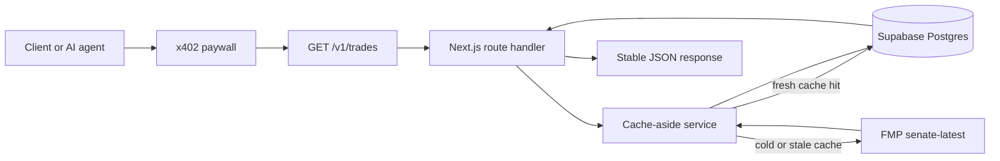

# Capitol Gains

[Live demo](https://capitolgains.xyz) · [API docs](https://capitolgains.xyz/docs) · [x402 discovery](https://capitolgains.xyz/.well-known/x402.json)


Capitol Gains is an x402 congressional trade data API. It packages U.S. Senate trade disclosures into a clean JSON endpoint, with x402 handling per-request payment and Supabase serving a cache-backed API contract.

The product goal is deliberately small: prove that an AI agent or developer can discover a paid data resource, satisfy an HTTP 402 payment requirement, and receive a stable response without account setup, subscriptions, or API keys.

## Why I Built This

I built Capitol Gains to get hands-on with x402, while using Claude and Codex to plan, build, and implement the entire project. Senate trades are public record, but the useful signal is scattered across disclosure portals and inconsistent formats. This project packages that data into a narrow, working vertical slice: one paid endpoint, a normalized cache, machine-readable discovery, and a deployed product surface.

## Demo

The live site is at [capitolgains.xyz](https://capitolgains.xyz). The homepage shows a free sample response, and the paid endpoint demonstrates the full `402 -> pay -> 200` loop:

```http
GET https://capitolgains.xyz/v1/trades?member=John%20Fetterman

HTTP/2 402 Payment Required
# client pays $0.05 USDC on Base Sepolia, then retries

HTTP/2 200 OK
{
  "member": { "display_name": "John Fetterman" },
  "trades": [
    {
      "symbol": "BXSL",
      "transaction_type": "Sale",
      "transaction_date": "2026-04-13",
      "disclosure_date": "2026-05-06",
      "amount_raw": "$1,001 - $15,000"
    }
  ],
  "metadata": { "cache_hit": true }
}
```

## Product Scope

V1 supports one paid endpoint:

```http
GET https://capitolgains.xyz/v1/trades
```

Supported query parameters:

- `member` - required exact name. V1 supports `Gary Peters` and `John Fetterman`.
- `from` - optional inclusive `YYYY-MM-DD` transaction date lower bound.
- `to` - optional inclusive `YYYY-MM-DD` transaction date upper bound.

The endpoint costs `$0.05` USDC per successful call on Base Sepolia testnet. Requests without payment receive `402 Payment Required`; paid retries receive normalized JSON data from the cache/API layer.

## Product Decisions

- **Cache-aside over live proxy:** The API serves normalized rows from Supabase instead of proxying FMP on every paid request. That keeps the public contract stable, reduces upstream dependency during paid calls, and makes freshness explicit.
- **x402 over API keys:** The project tests a no-account purchase flow where payment happens at the HTTP layer. That is the core product bet: agents should be able to pay for a resource without onboarding into a SaaS dashboard first.
- **Two-senator V1 scope:** V1 supports Gary Peters and John Fetterman only. That is a deliberate vertical slice: prove data ingestion, normalization, caching, docs, discovery, payment, and client behavior end to end before broadening coverage.
- **Typed errors over silent fallbacks:** Invalid members and malformed date filters return explicit JSON errors. Clients should know when a paid request failed because of input shape rather than receiving ambiguous empty data.
- **Testnet first:** Base Sepolia validates the payment workflow without presenting the project as a production financial data service.

## How This Was Built

This was built with AI coding tools in an intentionally hands-on workflow. I owned the product scope, architecture, tradeoffs, ticket sequencing, review criteria, and launch checklist; AI agents helped implement, test, and iterate against that direction. The result is meant to show practical fluency with the 2026 AI-assisted build stack: scoping a small product, decomposing it into tickets, using tools to move quickly, and still holding the line on correctness, security, and product judgment.

## Architecture



Public marketing, docs, health, and discovery routes are served by the same Next.js app. The x402 proxy only protects `/v1/*`; public pages and discovery files remain free so developers and agents can understand the product before paying.

## Public Routes

- `/` - marketing landing page.
- `/docs` - API reference and sample response.
- `/api/health` - free liveness check.
- `/.well-known/x402.json` - machine-readable x402 service descriptor.
- `/llms.txt` - agent-readable usage notes.

## Repository Structure

- `app/` - Next.js App Router pages and API routes.
- `components/site/` - presentation components for the marketing/docs site.
- `lib/trades/` - V1 response contract, validation, and trade service.
- `lib/db/` - typed Supabase/Postgres data access.
- `lib/fmp/` - FMP upstream client and normalization.
- `lib/x402/` - x402 discovery descriptor generation and validation.
- `supabase/migrations/` - database schema and RLS migrations.
- `fixtures/` - committed sample upstream and API response data.
- `scripts/` - local verification, cache refresh, and x402 client scripts.
- `docs/` - product/API contract notes for the V1 demo.

## Local Development

```bash
pnpm install
cp .env.example .env.local
pnpm dev
```

The development server runs at [http://localhost:3000](http://localhost:3000).

## Environment Variables

Use `.env.example` as the template and keep real values in `.env.local` or Vercel environment variables. `.env.local` is ignored by git.

Required for the deployed API:

```bash
SUPABASE_URL=
SUPABASE_ANON_KEY=
SUPABASE_SERVICE_ROLE_KEY=
SUPABASE_DB_POOLER_URL=
BASE_SEPOLIA_RECEIVING_WALLET_ADDRESS=
FMP_API_KEY=
```

Required only for local paid-client demos:

```bash
X402_CLIENT_PRIVATE_KEY=
X402_TRADES_URL=
X402_TRADES_INVALID_URL=
```

## Verification

Run the standard checks:

```bash
pnpm lint
pnpm build
```

Refresh the cache manually:

```bash
npx tsx --conditions react-server --env-file=.env.local scripts/refresh-cache.mjs
```

Run the standalone x402 client against the deployed paid endpoint:

```bash
npx tsx --conditions react-server --env-file=.env.local scripts/x402-trades-client.ts
```

The client verifies the core paid API loop:

- unpaid request returns `402`;
- paid retry returns `200`;
- repeat paid request returns a cached response;
- invalid member requests return a typed error.

## Security and Compliance Notes

- Real secrets belong only in `.env.local` and Vercel environment variables.
- `.env.example` contains placeholders only.
- The API returns public disclosure data, not investment advice.
- V1 is a testnet portfolio demo, not a broker, adviser, exchange, or production financial data service.
