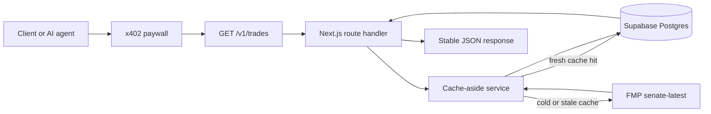

# Capitol Gains

[Live demo](https://capitolgains.xyz) · [API docs](https://capitolgains.xyz/docs) · [x402 discovery](https://capitolgains.xyz/.well-known/x402.json)


Capitol Gains is a portfolio V1 of an agent-payable congressional trade data API. It packages public U.S. Senate trade disclosures behind a narrow paid JSON endpoint, using x402 for per-call payment, Supabase for cache-backed reads, and Financial Modeling Prep as the upstream data source.

The product goal is deliberately small: prove that an AI agent or developer can discover a paid data resource, satisfy an HTTP 402 payment requirement, and receive a stable API response without account setup, subscriptions, or API keys.

## Product Scope

V1 supports one paid endpoint:

```http
GET https://capitolgains.xyz/v1/trades
```

Supported query parameters:

- `member` - required exact name. V1 supports `Gary Peters` and `John Fetterman`.
- `from` - optional inclusive `YYYY-MM-DD` transaction date lower bound.
- `to` - optional inclusive `YYYY-MM-DD` transaction date upper bound.

The endpoint costs `$0.05` USDC per successful call on Base Sepolia testnet. Requests without payment receive `402 Payment Required`; paid retries receive normalized JSON data from the cache/API layer.

## Architecture



Public marketing, docs, health, and discovery routes are served by the same Next.js app. The x402 proxy only protects `/v1/*`; public pages and discovery files remain free so developers and agents can understand the product before paying.

## Product Decisions

- **Narrow V1 dataset:** two senators instead of a broad but unreliable member search surface. This keeps testing, cache freshness, and response contracts easy to verify.
- **Payment at the protocol layer:** x402 removes subscription and API-key setup from the buyer flow. The API can be consumed by agents that understand HTTP 402 payment requirements.
- **Cache-aside data model:** Supabase stores normalized member and transaction rows so the paid endpoint can return a stable contract even though upstream FMP fields may change.
- **Explicit public contract:** `/docs`, `/.well-known/x402.json`, and `/llms.txt` make the endpoint understandable to both humans and agents.
- **Testnet launch:** Base Sepolia is used intentionally for a portfolio/demo release. This validates the payment flow without treating the product as a live financial service.

## Public Routes

- `/` - marketing landing page.
- `/docs` - API reference and sample response.
- `/api/health` - free liveness check.
- `/.well-known/x402.json` - machine-readable x402 service descriptor.
- `/llms.txt` - agent-readable usage notes.

## Repository Structure

- `app/` - Next.js App Router pages and API routes.
- `components/site/` - presentation components for the marketing/docs site.
- `lib/trades/` - V1 response contract, validation, and trade service.
- `lib/db/` - typed Supabase/Postgres data access.
- `lib/fmp/` - FMP upstream client and normalization.
- `lib/x402/` - x402 discovery descriptor generation and validation.
- `supabase/migrations/` - database schema and RLS migrations.
- `fixtures/` - committed sample upstream and API response data.
- `scripts/` - local verification, cache refresh, and x402 client scripts.
- `docs/` - product/API contract notes for the V1 demo.

## Local Development

```bash
pnpm install
cp .env.example .env.local
pnpm dev
```

The development server runs at [http://localhost:3000](http://localhost:3000).

## Environment Variables

Use `.env.example` as the template and keep real values in `.env.local` or Vercel environment variables. `.env.local` is ignored by git.

Required for the deployed API:

```bash
SUPABASE_URL=
SUPABASE_ANON_KEY=
SUPABASE_SERVICE_ROLE_KEY=
SUPABASE_DB_POOLER_URL=
BASE_SEPOLIA_RECEIVING_WALLET_ADDRESS=
FMP_API_KEY=
```

Required only for local paid-client demos:

```bash
X402_CLIENT_PRIVATE_KEY=
X402_TRADES_URL=
X402_TRADES_INVALID_URL=
```

## Verification

Run the standard checks:

```bash
pnpm lint
pnpm build
```

Refresh the cache manually:

```bash
npx tsx --conditions react-server --env-file=.env.local scripts/refresh-cache.mjs
```

Run the standalone x402 client against the deployed paid endpoint:

```bash
npx tsx --conditions react-server --env-file=.env.local scripts/x402-trades-client.ts
```

The client verifies the core paid API loop:

- unpaid request returns `402`;
- paid retry returns `200`;
- repeat paid request returns a cached response;
- invalid member requests return a typed error.

## Security and Compliance Notes

- Real secrets belong only in `.env.local` and Vercel environment variables.
- `.env.example` contains placeholders only.
- The API returns public disclosure data, not investment advice.
- V1 is a testnet portfolio demo, not a broker, adviser, exchange, or production financial data service.
