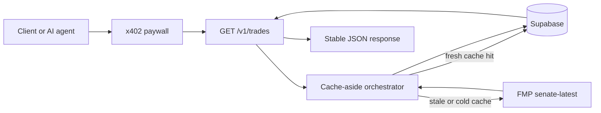

# Capitol Gains

Capitol Gains is a Next.js 16 App Router project that hosts a public marketing site, API docs, x402 discovery files, and the paid `/v1/trades` API. The V1 data path is FMP `senate-latest` upstream data normalized into a Supabase cache-aside layer, then served through an x402-gated JSON endpoint on Base Sepolia.

V1 intentionally scopes the cache/API to two Senate members only: Gary Peters (D-MI) and John Fetterman (D-PA). The scope matches the committed FMP fixture and the current paid endpoint verification data.

## Architecture



The marketing and discovery routes are free. The proxy matcher only covers `/v1/*`, and the current paid production resource is `GET https://capitolgains.xyz/v1/trades`.

## Local setup

```bash
npm install
cp .env.example .env.local
npm run dev
```

The development server runs at [http://localhost:3000](http://localhost:3000).

## Environment variables

Document required variables in `.env.example` and keep machine-specific secrets in `.env.local`, which is ignored by git. Mirror the server-side variables in Vercel project settings.

Required for the deployed API:

```bash
SUPABASE_URL=
SUPABASE_ANON_KEY=
SUPABASE_SERVICE_ROLE_KEY=
SUPABASE_DB_POOLER_URL=
BASE_SEPOLIA_RECEIVING_WALLET_ADDRESS=
FMP_API_KEY=
```

Required only for local paid-client demos:

```bash
X402_CLIENT_PRIVATE_KEY=
X402_TRADES_URL=
X402_TRADES_INVALID_URL=
```

## Public routes

- `/` - marketing landing page.
- `/docs` - API reference and static sample response.
- `/pricing` - x402 pay-per-call pricing and disclaimers.
- `/api/health` - free liveness check.
- `/.well-known/x402.json` - machine-readable x402 service descriptor.
- `/llms.txt` - concise agent instructions.

## Paid API

```http
GET https://capitolgains.xyz/v1/trades?member=John%20Fetterman&from=2026-04-01&to=2026-04-30
```

V1 requires exact `member` names:

- `Gary Peters`
- `John Fetterman`

The endpoint costs `$0.05` USDC per call on Base Sepolia through x402. A request without payment returns `402`; after payment, the same request returns the stable JSON contract documented in `/docs`.

## Cache verification

Run the Epic 3 cache integration check with:

```bash
npx tsx --conditions react-server --env-file=.env.local scripts/verify-epic3-cache.mjs
```

Run the Epic 4 local integration check with:

```bash
npx tsx --conditions react-server --env-file=.env.local scripts/verify-epic4-local.mjs
```

Refresh the live cache manually with:

```bash
npx tsx --conditions react-server --env-file=.env.local scripts/refresh-cache.mjs
```

The refresh script scans the first two FMP `senate-latest` pages, upserts in-scope rows for both V1 senators, marks each member fresh for 24 hours, and prints a JSON summary of pages fetched, FMP calls spent, and rows upserted. If FMP restricts page 1 on the current API plan, the script logs the restricted page and continues only when page 0 already contains rows for both V1 senators.

## x402 test client

Run the standalone TypeScript client against the deployed paid endpoint:

```bash
npx tsx --conditions react-server --env-file=.env.local scripts/x402-trades-client.ts
```

The client performs:

- unpaid request -> `402`
- paid retry -> `200`
- second identical paid request -> `cache_hit: true`
- invalid member paid request -> typed `404`

Use `X402_CLIENT_PRIVATE_KEY` for a funded Base Sepolia test wallet. Do not commit private keys.

## Security notes

- `.env.local` is gitignored and must remain local.
- The FMP API key should live only in local/Vercel environment variables.
- The FMP key previously pasted in chat should be rotated before treating V1 as more than a private portfolio demo.
- This project is not investment advice. Data is public U.S. Senate disclosure data via FMP.
